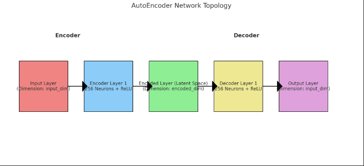
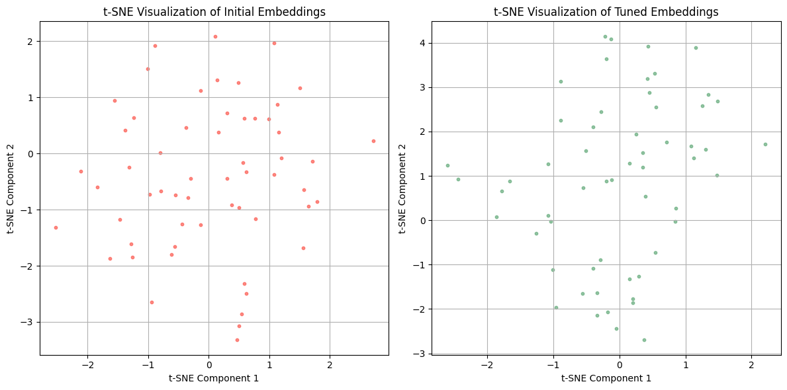

# Natural Language Processing - APS 02
## Most Relevant Trip Advisor Restaurants Vector-Based Search 🍝🦉

## Objective 🎯
The goal of this project was to develop an information retrieval system using embeddings. This system will serve as an alternative to the previously implemented TF-IDF model on APS 01.

## Database 🍝🦉📊
For this project I used Trip Advisor's website as a source for my web scrapper to gather the data and assemble my database. All restaurants found in the database are from São Paulo, SP, Brazil and the reviews are real customer's reviews. Each entry in the dataset includes the restaurant name and reviews provided by users. The reviews capture various aspects of dining experiences, offering insights into customer satisfaction and restaurant quality.

## Step 01

### Generating the Embeddings 🌐
To generate embeddings for the restaurant reviews, I utilized a pre-trained sentence-transformer model known as sBERT (Sentence-BERT). This model is particularly suited for generating sentence embeddings and is based on BERT architecture. The process involves tokenizing the reviews and passing them through the model to obtain the initial embeddings. These embeddings are then reduced to a single vector using mean pooling of the last hidden states. Following this, I applied a deep denoising auto-encoder to further refine the embeddings. The auto-encoder architecture consists of an encoder that compresses the input to a lower-dimensional representation and a decoder that reconstructs the input from this representation. The input dimension is defined by the size of the initial embeddings, while the encoded dimension is set to 128. The following figure illustrates the auto-encoder architecture used for this project.

### Training Process and Loss Function 💪
The training process of the auto-encoder involves minimizing the Mean Squared Error (MSE) loss function, which measures the average squared difference between the input embeddings and the reconstructed embeddings. This loss function is appropriate for our problem as it effectively captures the reconstruction quality, guiding the model to learn meaningful representations of the input data. The training is performed for 20 epochs using the Adam optimizer, which adapts the learning rate during training to achieve optimal convergence.

#### Loss Function Equation
The loss function can be expressed as shown bellow:

$$
\text{Loss} = \frac{1}{N} \sum_{i=1}^{N} (x_i - \hat{x}_i)^2
$$

Where N is the number of embeddings, $${x_i}$$ is the original embedding, and $${\hat{x}_i}$$ is the reconstructed embedding from the auto-encoder.

## Step 02

### Visualize the Embeddings 🕵️‍♂️

In this step, I visualized the embeddings obtained from my dataset by projecting them into a 2D space using t-SNE. As discussed in the project statement, while PCA is fast and is a commonly used technique for dimensionality reduction, it may not effectively capture the structure of my high-dimensional embeddings due to the complex manifold they reside in. Instead, I employed t-SNE, which is designed to better preserve local structures and can provide more insightful visualizations. So, the t-SNE visualization was used to plot two scatter plots: one for the initial embeddings and another for the tuned embeddings.

In both figures, I observed that the 57 restaurants are spread out across the 2D space without distinct clusters. The lack of clear clustering in the visualizations is probably due to the small number of restaurants in the dataset and not having enough reviews per restaurant. This makes it hard for the embeddings to really pick up on the unique features of each restaurant. If we had a larger dataset with more reviews for each restaurant, it could help the model better capture those meaningful differences. However, even with these limitations, I could see a slight improvement in the fine-tuned embeddings visualization compared to the original embeddings. In the fine-tuned version, there is a subtle, emerging cluster-like behavior, suggesting that fine-tuning helps the model begin to differentiate among restaurants to some degree. This improvement is likely due to the fine-tuning process adapting the embeddings more closely to the specific context and nuances of restaurant reviews, allowing for finer distinctions to emerge.

## Step 03

### Search System 🔎💻
In this step, I developed my search system, building upon the foundation laid in APS 01. The key focus was to implement a system that could effectively retrieve restaurants based on user queries. To achieve this, I utilized embeddings generated from our data, and the similarity between these embeddings was calculated using cosine similarity, which measures how similar two vectors are in a multi-dimensional space.

The search process involved the following steps:
1. Query Processing: When a user inputs a query, I tokenize the query and pass it through the model to obtain an embedding representation of the input.

2. Embedding Generation: Generate a tuned embedding of the query using the autoencoder, which helps refine the representation to capture more meaningful features relevant to our dataset.

3. Similarity Calculation: Using cosine similarity, I compare the query embedding against the embeddings of all restaurants in our dataset. Cosine similarity provides a measure of similarity between the query and each restaurant embedding, helping us identify which restaurants are most relevant.

4. Result Retrieval: Finally, we retrieve the names of the top restaurants that have a similarity score above a specified threshold (0.7 was used in this case to ensure a minimal relevant similarity score).

### Tests (same as APS 01)

Test 1 Results ('sushi'):
1. A Casa do Porco - Similarity: 0.8457
2. Noah Gastronomia Paulista - Similarity: 0.8455
3. Baggio Pizzaria & Focacceria Moema - Similarity: 0.8446
4. Pizzaria Veridiana Jardins - Similarity: 0.8428
5. Bráz Quintal - Similarity: 0.8427
6. Myk Restaurante - Similarity: 0.8425
7. Djapa - Similarity: 0.8409
8. La Braciera Pizza Napoletana - Similarity: 0.8393
9. Parrillada Fuego Celeste - Similarity: 0.8376
10. Dona Firmina Pizzaria - Similarity: 0.8375

Test 2 Results ('hambúrguer'):
1. Baggio Pizzaria & Focacceria Moema - Similarity: 0.7239
2. La Braciera Pizza Napoletana - Similarity: 0.7225
3. I Love Burger - Similarity: 0.7213
4. Vicolo Nostro - Similarity: 0.7183
5. Djapa - Similarity: 0.7182
6. A Casa do Porco - Similarity: 0.7180
7. Myk Restaurante - Similarity: 0.7179
8. Famiglia Mancini - Similarity: 0.7175
9. Noah Gastronomia Paulista - Similarity: 0.7167
10. Modern Mamma Osteria - Similarity: 0.7165

Test 3 Results ('maravilhoso'):
1. Baggio Pizzaria & Focacceria Moema - Similarity: 0.9284
2. Bráz Quintal - Similarity: 0.9274
3. Osaka Cocina Nikkei - Similarity: 0.9267
4. Figueira Rubaiyat - Similarity: 0.9251
5. Fogo De Chão Moema - Similarity: 0.9246
6. CipóRestô - Similarity: 0.9242
7. La Braciera Pizza Napoletana - Similarity: 0.9233
8. Vista Restaurante - Similarity: 0.9232
9. Casarìa SP - Similarity: 0.9231
10. Sushi Isao - Similarity: 0.9229
